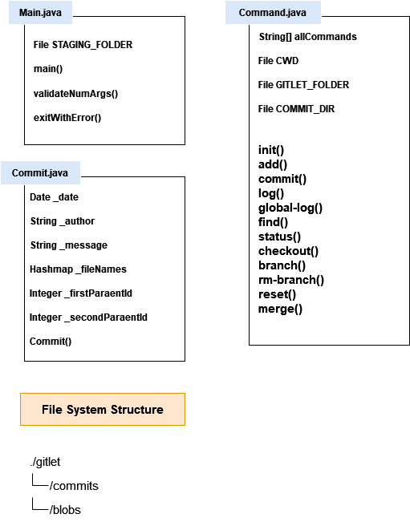

# Gitlet Design Document

**Author**: Zwea Htet

## Design Document Guidelines

Please use the following format for your Gitlet design document. Your design
document should be written in markdown, a language that allows you to nicely 
format and style a text file. Organize your design document in a way that 
will make it easy for you or a course-staff member to read.  

## 1. Classes and Data Structures

Include here any class definitions. For each class list the instance
variables and static variables (if any). Include a ***brief description***
of each variable and its purpose in the class. Your explanations in
this section should be as concise as possible. Leave the full
explanation to the following sections. You may cut this section short
if you find your document is too wordy.

### Main.java
This class is the entry point of the program. It implements methods to set 
up persistance and support each command of the program.

#### Fields:
1. : an arraylist representing a list of modified files in current repo.
2. Commit _mostRecentCommit: A pointer to the most recent commit.

### Commit.java
This class represents a commit object and stores new version of files
on our recent commit command.

#### Fields:
1. Date _timestamp: a date object representing the timestamp when the current commit is created.
2. String _author: a string representing the name of the author
3. String _message: a string representing the commit message
4. Hashmap _fileNames: a hashmap representing the mapping of file names to blob references.
5. Integer _firstParentId: an integer representing the reference to the first parent.
6. Integer _secondParentId: an integer representing the reference to the second parent (for merges).

### Commands.java
This class contains all the commands necessary for Gitlet.

#### Fields
1. String[] allCommands: an array representing all commands of our Gitlet program.
2. static final File CWD: A pointer to the current working directory of the program.
2. static final File GITLET_FOLDER: A pointer to the `.gitlet` directory in the current working directory.
3. static final File COMMIT_DIR: A pointer to the `.commits` directory in the current working directory.

### ~~Blobs.java~~
* ~~store versions of contents in each file.~~

### ~~StagingArea.java~~
* ~~hold files (and their contents) that should be tracked in the next commit,
  and should not be tracked in the next commit.~~

### File System Structure
.gitlet  
|_ commits  
|_ blobs  
|_ staging area  

## 2. Algorithms

This is where you tell us how your code works. For each class, include
a high-level description of the methods in that class. That is, do not
include a line-by-line breakdown of your code, but something you would
write in a javadoc comment above a method, ***including any edge cases
you are accounting for***. We have read the project spec too, so make
sure you do not repeat or rephrase what is stated there.  This should
be a description of how your code accomplishes what is stated in the
spec.

The length of this section depends on the complexity of the task and
the complexity of your design. However, simple explanations are
preferred. Here are some formatting tips:

* For complex tasks, like determining merge conflicts, we recommend
  that you split the task into parts. Describe your algorithm for each
  part in a separate section. Start with the simplest component and
  build up your design, one piece at a time. For example, your
  algorithms section for Merge Conflicts could have sections for:

   * Checking if a merge is necessary.
   * Determining which files (if any) have a conflict.
   * Representing the conflict in the file.
  
* Try to clearly mark titles or names of classes with white space or
  some other symbols.

### Main.java
1. main(String[] args): This is the entry point of the program. It first 
checks for edge cases (read the list below). Depending on the input argument, 
different functions are called to execute corresponding command. 
   1. empty arguments
   2. command that doesn't exist 
   3. wrong format of operands 
   4. no `gitlet` subdirectory in working directory (meaning Gilet has not been initialized.)
2. exitWithError(String message): It prints out MESSAGE and exits with error code -1.
3. validateNumArgs(String cmd, String[] args, int n):  It checks the number of arguments versus the expected number 
and throws a RuntimeException if they do not match.

### Commit.java
1. Commit(): The class constructor. Save the state of the Commit and populate the 
mapping of file names to blob references. 

### Commands.java
1. init(): It creates a new version control system for current repository. It also create a 
new commit as our initial commit and set up branches.
2. add(): It adds a copy of the file to the staging area and overwrites the previous entry in
the staging area with the new contents. Before adding to the staging area, it checks to see whether
an identical entry is already existed.
3. commit(): It clones the most recent commit and makes changes to metadata and mapping as necessary. 
When mapping filenames to blob references in Hashmap, `Utils.sha1` method can be used on blob contents 
to generate unique id for indexing to avoid collisions. 
4. log(): It prints out the commit's history (backwards along the commit tree) with commit id,
   the timestamp and the commit message. 
5. global-log(): Todo
6. find(): Todo
7. status(): Todo
8. checkout(): Todo
9. branch(): Todo
10. rm-branch(): Todo
11. reset(): Todo
12. merge(): Todo

## 3. Persistence

Describe your strategy for ensuring that you don’t lose the state of your program
across multiple runs. Here are some tips for writing this section:

* This section should be structured as a list of all the times you
  will need to record the state of the program or files. For each
  case, you must prove that your design ensures correct behavior. For
  example, explain how you intend to make sure that after we call
       `java gitlet.Main add wug.txt`,
  on the next execution of
       `java gitlet.Main commit -m “modify wug.txt”`, 
  the correct commit will be made.
  
* A good strategy for reasoning about persistence is to identify which
  pieces of data are needed across multiple calls to Gitlet. Then,
  prove that the data remains consistent for all future calls.
  
* This section should also include a description of your .gitlet
  directory and any files or subdirectories you intend on including
  there.

### First Step
When we execute `java gitlet.Main init`, we create a Gitlet version-control
system in the current directory. 

* After calling `java gitlet.Main add [file name]` , we will first compare the 
version of the `[file name]` with the most recent commit. If we have different version, 
we will append the `[file name]` to the staging area (represented by an arraylist). 
* When we execute `java gitlet.Main commit [message]`, we will create a commit object
that points to the `[file name]` with modified contents and stores that object in `.gitlet` 
subdirectory (maybe in a new subdirectory called `commits` inside the `.gitlet` directory.) 
* In order to keep track of previous versions of commit, we will need to use some tree 
data-structures where each node stores a commit object and a pointer to previous versions.

### File Structure
#### Blobs 
* store versions of contents in each file.

### StagingArea
* hold files (and their contents) that should be tracked in the next commit,
and should not be tracked in the next commit.

## 4. Design Diagram

Attach a picture of your design diagram illustrating the structure of your
classes and data structures. The design diagram should make it easy to 
visualize the structure and workflow of your program.

